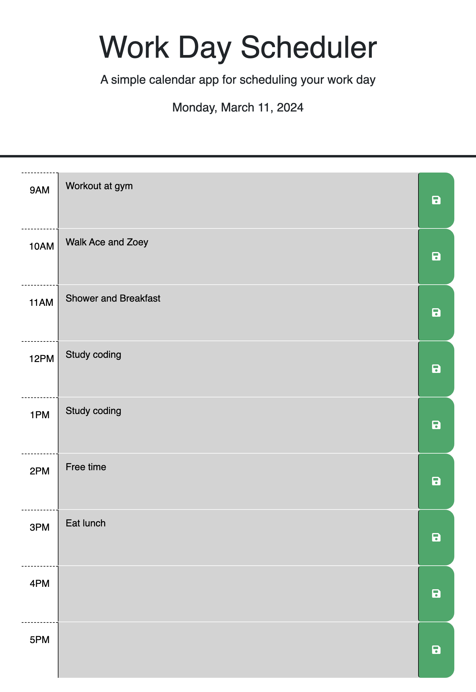

----Module 5 Challenge----
This project is a work day scheduler that allows the user to view past events, current events, and future events during the work day. The user is able to create and save events during their time-blocked work day. Key concepts that allowed this application to be functional included: HTML, CSS, advanced JavaScript, and the JQuery library (day.js).
Link to deployed website: https://sandyvzqz.github.io/Work-day-scheduler/

